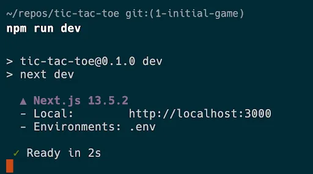
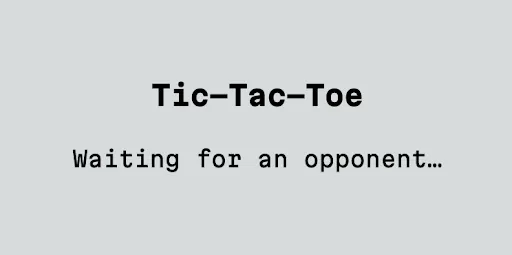
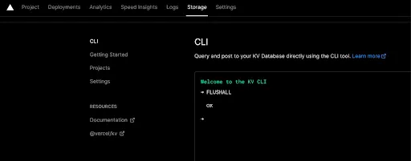

*I recently published a freelance post for [Ably](https://ably.com) that they published on [their company blog](https://ably.com/blog/how-to-add-an-in-game-chat-room-with-react). It was a ton of fun (and a lot of work!). I'm re-posting it here with permission. The header graphic was created by Ably. Enjoy!*


One of the most fun parts of playing games with other people is talking to your opponent:

> _"Have a good game!"  
> "Hmm... interesting move..."  
> "Your children's CHILDREN will rue this day!"_

Online games are no exception: they're a lot more fun if you can say hello to your opponent, or even debate some strategy. Many online games have built in chat mechanisms, but for more casual, web-based games, there are a lot of advantages to being able to add chat separately, in an abstracted way that can be applied to any game.

Ably makes it straightforward to add chat to a web application: it takes care of scaling and reliability concerns while packaging up a whole bunch of best practices and tools in their SDKs. It also works perfectly with serverless architectures, like Next.JS on Vercel, where you don't have single processes running continually.

**Adding chat to a multiplayer game**
-------------------------------------

I'm going to take you through how to add chat to a simple multiplayer game, using Ably. I'm going to be using one of my favorite technology stacks on the web right now, but don't worry if your stack looks a little different than mine. Almost everything we're going to cover is broadly applicable to React + Ably. We're going to be using Ably's [React Hooks](https://github.com/ably/ably-js/blob/main/docs/react.md), part of their [JavaScript SDK](https://www.npmjs.com/package/ably), which make it impressively straightforward to use Ably's features from inside a React app.

* [React](https://react.dev/)
* [TypeScript](https://www.typescriptlang.org/)
* [Next.JS](https://nextjs.org/)
* [Vercel](https://vercel.com/)
* [Tailwind CSS](https://tailwindcss.com/)

Chat features
-------------

We're going to start with a straightforward chat app that lets two players of a multiplayer game exchange messages. Then, in subsequent posts, I'm going to walk you through how to enhance that app with some of the features that make a chat app more interesting and engaging. I'll show you how to implement them in a compartmentalized, reusable way so that they can be added easily to any place in any app you might want to add chat functionality.

*   **Typing Indicator:** Show when the other person is currently typing, so you have added context about whether they're working on a reply.
*   **Presence:** Have your app respond to who's actually present in the chat.
*   **Emoji Reactions:** Let your users add emojis as an added way of responding to messages. 😜

Tic-tac-toe
-----------


We're going to take a simple game of tic-tac-toe as our starting point. If you'd like to bootstrap the project and run it on your own, you'll need:

*   An [Ably account](https://ably.com/sign-up) — a free account is more than enough for this project.
*   A [Vercel account](https://vercel.com/signup) — the hobby tier (free) is plenty.
*   A [Vercel KV Database](https://vercel.com/docs/storage/vercel-kv) that will hold the game's state (one KV DB is free for the hobby tier).
*   A [forked copy of our tic-tac-toe game](https://github.com/neagle/tic-tac-toe/tree/1-initial-game) to start from, starting with the `1-initial-game` branch. When forking the repo in GitHub, make sure to untick the "Copy main branch only" option that is the default so that you bring over all the branches.


To get things running locally, you'll need your own versions of your own account credentials for Ably and for Vercel. The [repo](https://github.com/neagle/tic-tac-toe/tree/1-initial-game) has an example `.env.template` file in its root to show you what values you need, so you can start by duplicating it to create an `.env` file that will contain your values.

```sh
cp env.template .env
```

Then you should edit the .env file:

```sh
ABLY_API_KEY=
KV_URL=
KV_REST_API_URL=
KV_REST_API_TOKEN=
KV_REST_API_READ_ONLY_TOKEN=
```

[How to find your Ably API Key](https://ably.com/docs/ids-and-keys).

[How to create a KV store and get the credentials you'll need from it](https://vercel.com/guides/using-vercel-kv). Once you've added your own values, install the project's dependencies and fire it up:

    npm i
    npm run dev
    



Now you should be able to open up [http://localhost:3000](http://localhost:3000) in a browser and see the app running:



If you want to try playing a game, open [localhost:3000](http://localhost:3000/) in a different browser, or in a private / incognito window. (It won't work to just open it in another tab: your tabs share the same localStorage, and therefore the same playerId.)


NOTE: If you ever manage to get into a broken game state while you're working on this app, the simplest way to wipe the slate clean is to wipe clean your Vercel KV store. You can do that by accessing your KV Storage CLI in Vercel's dashboard for your project storage and typing `FLUSHALL` to blow everything away.



**How the game works**
----------------------

This implementation of tic-tac-toe is intended to be very simple.

1. When a user visits the site, it checks if there's already someone waiting to play.
2. If there's an open game, start playing!
3. If not, start an open game and wait for an opponent.


The state for the game is kept as a JSON object in Vercel's KV Storage, which is just Redis, a highly performant and very popular way to store keys and values.

The game itself also uses Ably to send updates when players play moves. In this article, we're not going to get into detail on how the game is constructed (so that we can focus on chat!), but I want to point out the aspects of our setup that get Ably up and running.

Now the fun part: Adding chat!
------------------------------

Ably's channels let us segment realtime traffic so that everything isn't part of the same stream. In this example, that maps naturally to the concept of games. Each game is its own channel, so that we can group all game-related messages together.

### A new type of message using `name`

Within channels, we can diversify the messages we send with the `name` attribute. Using different `name` values for different types of messages lets us compartmentalize different kinds of information flowing back and forth in our channels.

The tic-tac-toe app comes out of the box using messages with the `update` name to let clients subscribe to updated game states published by the backend. To add chat-related functionality, we can start sending and receiving different kinds of messages. For basic chat, I don't think we can go wrong with `message`.

### A new component: `Chat`

To add new chat functionality to the app, we're going to want to encapsulate as much logic as possible in a new component. That new component can keep track of its own state and, ideally, make it easy to re-use the logic elsewhere.

This is what our `/src` directory looks like right now:

```plaintext
src
├── app
│   ├── app.tsx
│   ├── components
│   │   ├── Game.tsx
│   │   └── grid
│   │       ├── Grid.tsx
│   │       └── Pieces.tsx
│   ├── favicon.ico
│   ├── globals.css
│   ├── layout.tsx
│   └── page.tsx
├── gameUtils.ts
└── types
    └── Game.ts
```

Because we're going to add several pieces of chat-related functionality to the app before we're done, let's create a new folder in `components` called `chat`, and then, inside that, create a new file called `Chat.tsx`.

Since I'm using TypeScript, I also like to keep my types together in a central location. I'm using `/src/types/`, which is just one convention of many valid ones. Let's also create a new `Chat.ts` file in types where we can put any types that we create for our chat. Here's our updated file diagram:

```plaintext
src
├── app
│   ├── app.tsx
│   ├── components
│   │   ├── Game.tsx
│   │   ├── chat
│   │   │   └── Chat.tsx
│   │   └── grid
│   │       ├── Grid.tsx
│   │       └── Pieces.tsx
│   ├── favicon.ico
│   ├── globals.css
│   ├── layout.tsx
│   └── page.tsx
├── gameUtils.ts
└── types
    ├── Chat.ts
    └── Game.ts
```

Now, let's set up the files. We always want to start simple and progress from there, so we're going to just set up the component and make sure it works at the most basic level. I will start you out with a bunch of Tailwind classes that give this some design to start with, since design isn't our focus in this article.

Let's create a basic functional component in `Chat.tsx`:

    const Chat = () => {
      return (
        <div className="chat">
    	<div>
            <ul className="messages">
              <li>Hi there!</li>
            </ul>
            <div className="chat-input">
              <input
                type="text"
                autoFocus={true}
              />
              <button>Send</button>
            </div>
          </div>
        </div>
      );
    };
    
    export default Chat;
    

We haven’t got anything in here yet other than some HTML and classes for styling. We've created:

*   A list where we can display chat messages.
*   An input where the user can type a new message.
*   A button the user can click to send their message.

Next, let's pull it into our `<Game />` component. All we need to do is add an `import` for `Chat`, and then to add that `<Chat />` component somewhere in the JSX that our functional component returns. Here's the updated `Game.tsx` with some of the irrelevant content left out. The only bit of fanciness to note is that we're going to only display the `Chat` component if there are two players in the game so that it doesn't appear when there's just a single player waiting on a game.

    import { createContext, useContext, useMemo } from "react";
    import * as Ably from "ably";
    import { useChannel } from "ably/react";
    import Grid from "./grid/Grid";
    import Chat from "./chat/Chat";
    import { useAppContext } from "../app";
    
    ...
    
    const Game = () => {
      const { game, playerId, setGame } = useAppContext();
      
      ...
    
      return (
        <GameContext.Provider value={{ opponentId }}>
          <div className="game">
            <Grid />
            {game.players.length > 1 && <Chat />}
          </div>
        </GameContext.Provider>
      );
    };
    
    export default Game;

Make sure that you can see your new chat component when you have a game underway.


### Building out the chat component

At the high level, the requirements for our chat app are pretty simple. Here's what we need:

*   A channel id to join,
*   An instance of the Ably client,
*   A stateful array to hold messages,
*   A handler for our input to publish messages to the channel.

**Channel ID**

If you read around `/src/app/app.tsx` and `/src/app/components/Game.tsx`, you might notice that we're using Context to provide two additional sources of state to any component that wants to access it:

*   `AppContext`, which has information that's applicable to the whole app.
*   `GameContext`, which has information specific to each game.

For our chat, we're going to want to access the game's ID to use as the channel name.

To access those values, we need to import `AppContext` and pull out the values we need inside the function:

    import { useAppContext } from "../../app";
    
    const Chat = () => {
      const { game } = useAppContext();
      ...
    };

**An instance of the Ably Client**

To use the Ably client we set up earlier, we're going to use the `useChannel` hook provided by the Ably SDK's React Hooks. We'll create a handler that doesn't do anything but log incoming messages to the console as a placeholder.

We'll also import Ably to use its types so that we can describe the shape of incoming messages.

    // new imports
    import { useChannel } from "ably/react";
    import * as Ably from "ably/promises";
    
    // inside the function component
    const { channel } = useChannel(`game:${game.id}`, (message: Ably.Types.Message) => console.log('message:', message));

**A stateful array for chat messages**

For this, we'll use React's `useState`. Since we're using TypeScript, let's also create a `Message` type in `/src/types/Chat.ts` so we can describe the shape of the objects we'll be storing.

    // src/types/Chat.ts
    export type Message = {
      clientId: string;
      text: string;
      timestamp: number;
      id: string;
    };

Also, let's replace the existing placeholder `<li>` tag with a `{messages.map(message => ...)}` section inside of our JSX that will iterate over the messages array and display each individual message.

```typescript
import { useState } from 'react';
import * as ChatTypes from '../../../types/Chat';

const Chat = () => {
  ...
  const [messages, setMessages] = useState<ChatTypes.Message[]>([]);
  ...

    return (
    <div className="chat">
      <div>
        <ul className="messages">
          {messages.map((message) => {
            const name = message.clientId;
  
            return (
              <li key={message.id} className="user-message">
                <b>{name}:</b> {message.text}
              </li>
            );
          })}
        </ul>
        ...
      </div>
    </div>
  );
}
```

**A handler for our input to publish changes to the channel**

We'll use a standard approach for a controlled input. We'll create:

* A state value and setter for the input using `useState`.
* A handler that updates the state using the setter when the input's value changes.
* A handler for the keyDown event that sends the message if the user hits "enter."
* A send function that uses the `channel` to publish the message and clear the input.

```typescript
// State for the chat text input
const [inputValue, setInputValue] = useState<string>("");

const onSend = () => {
  // The first prop is the `name` (type) of the message
  channel.publish("message", inputValue);
  setInputValue("");
};

const onChange = (event: React.ChangeEvent<HTMLInputElement>) => {
  const text = event.target.value;
  setInputValue(text);
};

const onKeyDown = (event: React.KeyboardEvent<HTMLInputElement>) => {
  if (event.key === "Enter" && inputValue !== "") {
    onSend();
  }
};
```

Then we just need to hook up these handlers to the elements themselves:

```typescript
return (
  <div className="chat">
    <div>
      <ul className="messages">
        {messages.map((message) => {
          const name = message.clientId;

          return (
            <li key={message.id} className="user-message">
              <b>{name}:</b> {message.text}
            </li>
          );
        })}
      </ul>
      <div className="chat-input">
        <input
          type="text"
          autoFocus={true}
          onChange={onChange}
          onKeyDown={onKeyDown}
          value={inputValue}
        />
        <button
          onClick={onSend}
          disabled={inputValue === ""}
        >
          Send
        </button>
      </div>
    </div>
  </div>
);
```

**Test it out**

Before we start saving the messages, it’s a good idea to test what we have so far. If you open your console, you should be able to see a message you type into the input come through... to _both_ the browser that sent it and to the other browser connected to the same game. It also gives you a chance to look at the structure of the messages that our channel publishes.


**Store incoming messages**

The last step is creating a handler that updates our `messages` state instead of just logging something to the console.

    const Chat = () => {
      ...
      const onMessage = (message: Ably.Types.Message) => {
        const { name, clientId, data, timestamp, id } = message;
        if (name === "message") {
          setMessages((messages) => [
            ...messages,
            { clientId, text: data, timestamp, id },
          ]);
        }
      };
    
      const { channel } = useChannel(`game:${game.id}`, onMessage);
      ...
    }

Now, if you try sending messages through the chat, you should wind up with a bona fide chat window!


In this case, the `playerId` is not a very elegant name to show in the chat screen. You could easily use a `username` instead if you have an app where a user has logged in. I am using random a generated `uuid` for each player in order to keep the app simple, and I have a helper function tucked in `src/gameUtils.ts` that will give us nicer names:

    import { playerName } from "../../../gameUtils";
    ...
    {messages.map((message) => {
      const name = playerName(message.clientId, game.players);
    
      return (
        <li key={message.id}>
          <b>{name}:</b> {message.text}
        </li>
      );
    })}


**Channel history**

But what happens if the user reloads their browser? The chat messages disappear, since the component's state only persists as long as the component stays in memory.

That may not be a problem, but if you want to have some channel history, one way to add that would be to add a persistence layer of some kind. Either save chat messages to a KV store or another database, or even just use [localStorage](https://developer.mozilla.org/en-US/docs/Web/API/Window/localStorage).

However, Ably's channels also have the ability to [rewind](https://ably.com/docs/channels/options/rewind) when joining a channel, to receive messages from "a point in time in the past, or for a given number of messages". That's perfect for our case. To use rewind we just need to use a special syntax to modify the channel name when we subscribe to it.

    const { channel } = useChannel(`[?rewind=100]${game.id}`, onMessage);
    

That will try to replay the last 100 messages, which is Ably's limit.

Note that, by default, this history will only stick around for two minutes. If you want your channels to keep history for 24 hours, you need to add a channel rule. If you want to add channel rules for dynamic channels, like the ones we're using in this app, you need to prefix your channel name with a namespace. I've already prefixed the channel names with `game:` so to enable persistence, we can add a channel rule using the Ably dashboard.

Go to your app, then click "Settings," then scroll down to "Channel rules" and click "Add new rule."


Add the namespace ("game") and check "Persist all messages."

Note the help text that warns you that persisting messages makes each message count twice against your monthly allocation, so you only want to enable channel history when it's actually useful.

**System messages**

Now that we have a working chat, you know what might be nice? If the chat could also show us system messages about the game, like a message when one player wins.

I have a small secret: the game engine is already sending such a message when a game ends. We just need to have our frontend display it.

    {messages.map((message) => {
      const name = playerName(message.clientId, game.players);
      // It's a system message if our utility function doesn't have
      // a name for the clientID
      const isSystemMessage = !Boolean(name);
    
      if (isSystemMessage) {
        return (
          <li key={message.id} className="system-message">
            {message.text}
          </li>
        );
      } else {
        return (
          <li key={message.id}>
            <b>{name}:</b> {message.text}
          </li>
        );
      }
    })}

**Clear the chat when the game changes**

One small issue you might notice if you play a few games is that the chat doesn't always reset when you start a new game. Let's clear messages whenever the `game.id` changes. React's `useEffect` hook is perfect for that kind of synchronization.

Update the React import:

```typescript
import { useEffect, useState } from "react";

// Clear the chat when the game changes
useEffect(() => {
  setMessages([]);
}, [game.id]);
```

**A couple presentational niceties**

While we're here, let's give the player names individual classes so that we can have them match the color of their pieces. Let's also bring in a truly classic npm package for dealing with classes in React called [classnames](https://www.npmjs.com/package/classnames) that also makes working with classes _much_ more readable.

Here's the final state of our `Chat` component:

```typescript
import { useEffect, useState } from "react";
import { useAppContext } from "../../app";
import { useChannel } from "ably/react";
import * as ChatTypes from "../../../types/Chat";
import * as Ably from "ably/promises";
import { playerName, playerNames } from "../../../gameUtils";
import classnames from "classnames";

const Chat = () => {
  const { game } = useAppContext();

  const [messages, setMessages] = useState<ChatTypes.Message[]>([]);

  const onMessage = (message: Ably.Types.Message) => {
    const { name, clientId, data, timestamp, id } = message;
    if (name === "message") {
      setMessages((messages) => [
        ...messages,
        { clientId, text: data, timestamp, id },
      ]);
    }
  };

  const { channel } = useChannel(`[?rewind=100]game:${game.id}`, onMessage);

  // Clear the chat when the game changes
  useEffect(() => {
    setMessages([]);
  }, [game.id]);

  // State for the chat text input
  const [inputValue, setInputValue] = useState<string>("");

  const onSend = () => {
    channel.publish("message", inputValue);
    setInputValue("");
  };

  const onChange = (event: React.ChangeEvent<HTMLInputElement>) => {
    const text = event.target.value;
    setInputValue(text);
  };

  const onKeyDown = (event: React.KeyboardEvent<HTMLInputElement>) => {
    if (event.key === "Enter" && inputValue !== "") {
      onSend();
    }
  };

  return (
    <div className="chat">
      <div>
        <ul className="messages">
          {messages.map((message) => {
            const name = playerName(message.clientId, game.players);
            const isSystemMessage = !Boolean(name);

            if (isSystemMessage) {
              return (
                <li key={message.id} className="system-message">
                  {message.text}
                </li>
              );
            } else {
              return (
                <li key={message.id} className="user-message">
                  <b
                    className={classnames(
                      {
                        "player-x": name === playerNames[0],
                        "player-o": name === playerNames[1],
                      }
                    )}
                  >
                    {name}:
                  </b>{" "}
                  {message.text}
                </li>
              );
            }
          })}
        </ul>
        <div className="chat-input">
          <input
            type="text"
            autoFocus={true}
            onChange={onChange}
            onKeyDown={onKeyDown}
            value={inputValue}
          />
          <button
            onClick={onSend}
            disabled={inputValue === ""}
          >
            Send
          </button>
        </div>
      </div>
    </div>
  );
};

export default Chat;
```


Any issues? Compare what you have against the `2-chat` [branch](https://github.com/neagle/tic-tac-toe/tree/2-chat).

Wrapping up
-----------

Congratulations! We now have a working chat application added alongside our game. But there's a lot more we can do to make chat more interesting.

In upcoming posts, I'll show you how we can add a reusable custom hook to indicate when the other person is typing, how we can use Ably's Presence feature to detect when the other person has left the chat, and how to let users add emoji reactions to individual messages. I hope you'll join me! In the meantime, you can tweet Ably [@ablyrealtime](https://twitter.com/ablyrealtime), drop them a line in [/r/ablyrealtime](https://www.reddit.com/r/ablyrealtime/), or follow me on Twitter/X: [@neagle](https://twitter.com/neagle).

*Originally written for Ably and posted on [their company blog](https://ably.com/blog/how-to-add-an-in-game-chat-room-with-react). Re-posted here with persmission.*
