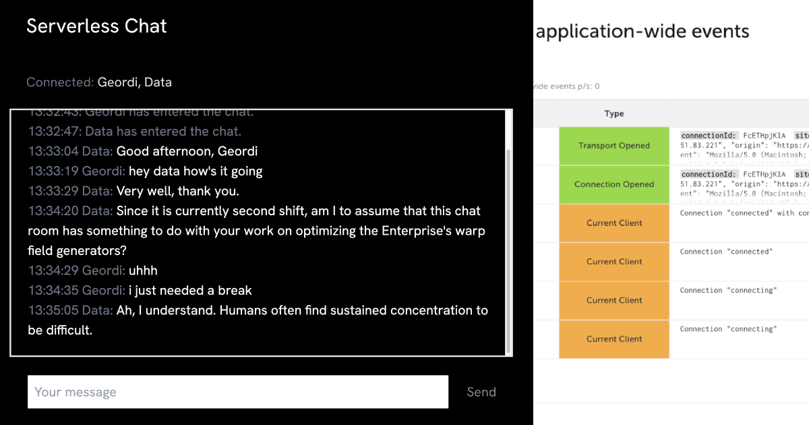

<a href="https://serverless-chat-neagle.vercel.app/"></a>

I'm working on modernizing an app that's almost a decade ago from a MEAN (Mongo, Express, Angular, NodeJS) stack to a serverless stack using NextJS. But one sticking point has been the need for WebSockets: my app uses WebSocket connections to deliver updates to users without the need for polling. They're ideal for any app where multiple users interact with a site at the same time and it's important to see when other users add content (like making comments).

The first option I tried exploring was [Server-Sent Events](https://developer.mozilla.org/en-US/docs/Web/API/Server-sent_events/Using_server-sent_events), or SSEs. SSEs are similar to WebSockets, but they're one-way only. For me, that's enough: I let the client send information to the server using REST endpoints (which works great with serverless); I just need a mechanism for sending information to the client when they haven't explicitly asked for it. (Which would just be polling.)

SSEs come dangerously close to working for serverless, and I completed [an entire proof-of-concept chat application in NextJS](https://github.com/neagle/serverless-chat/commit/f4d40f724f4b2a5e980ea50ab358cb5d4fbbaf61) that was working swimmingly in local development. The only problem: it relied on keeping [an array of client objects in memory](https://github.com/neagle/serverless-chat/commit/f4d40f724f4b2a5e980ea50ab358cb5d4fbbaf61#diff-486fb3c4e9b74759702ac1069f11783ffc358577373d0521f05fd476a0551f5cR6). One dangerous thing about serverless functions is that this will work _some of the time_. Because _sometimes_ serverless functions are run on the same computer when they're executed, but that's not a guarantee. Serverless functions are ephemeral by design, so in-memory storage won't scale once deployed.

I thought: that's fine--I'll just use an external store to keep track of the clients. So I hooked up [Vercel KV](https://vercel.com/docs/storage/vercel-kv), which is just a conveniently packaged version of Redis, where I could store my clients and retrieve them every time my function executed. No sweat! Everything was going great right up until I tried to `JSON.stringify` my clients array and received this:

```
Error [TypeError]: Converting circular structure to JSON.
```

Oh. Ohhhhhhhh. _Oh._ Not every object in JavaScript can be represented in JSON -- circular references can be a feature, not a bug. And the clients for SSEs are actual response objects, which can't be reduced to JSON and then rehydrated afterward. It's a hard reality, for the moment, but there seems to be no way to escape the need for a process that _keeps things in memory_ when it comes to realtime communication.

## Third-Party WebSocket Providers

Vercel, of course, [seems to say the same thing](https://vercel.com/guides/publish-and-subscribe-to-realtime-data-on-vercel) and provides a list of third-party providers that can make realtime communication possible. They don't spell out the reason you have to use a third party, which is one small quibble I have with their documentation.

The modern Jamstack is great in many ways, but it has the disadvantage of fragmenting what was once a single account and provider (in my case, [Linode](https://www.linode.com/) provided my VPS) into a whole portfolio. The advantage of using a specialized provider is usually that they'll do something particular really well, or make it particularly easy to use, but the disadvantage is having to manage a separate integration and think about the potential implication of those costs.

So I'm here to tell you: in the year 2023, at least, the nature of function as a service, which in their very nature require that they not guarantee running on the same computer, makes it necessary to reach to a separate service for real-time, non-polling communication.

## Enter Ably

I reached for [Ably](https://ably.com/) because they had a booth at the 2022 [Jamstack Conf](https://jamstack.org/conf/), and probably gave me a sticker or something. (You hear that? Sponsor your local tech conference!) They have a [generous free tier](https://ably.com/pricing), which is an absolute requirement for this space, where devs like me usually want to try a product on something that doesn't make us any money, and then that translates (ideally) into recommending it in our professional lives for products that _do_ make money, where paying for higher levels of invocations, compute time, or _whatever_ makes sense.

Integrating with Ably was (relatively) painless, though I want to go on record and recommend avoiding their [react hooks](https://www.npmjs.com/package/@ably-labs/react-hooks) package, which I found tripped me up more than it helped, especially as it had [an outstanding bug](https://github.com/ably-labs/react-hooks/issues/8) at the time of writing that affected me. But the good news is that using Ably's standard client in React isn't that tricky.

## Serverless Chat App

[Here is our Serverless Chat app](https://serverless-chat-neagle.vercel.app/). You can open it in multiple tabs to see the chat functionality in action. And [here's the project on Github](https://github.com/neagle/serverless-chat) if you want to dive straight into the source code.

Let's walk through the ingegration. This starts from an example NextJS boilerplate, which you can create with the command:

```sh
npx create-next-app <your-app-name>
```

### Overview

The app will have two primary components:

* **The serverless endpoint** - receives POST requests and broadcasts them via WebSocket
* **The client** - React app that handles all the fun UI and receives broadcasts via WebSocket

### Types

Before we create either of the primary components, let's go ahead and create a `types.ts` file in the root of our project where we can share any types that both the server and the client will need.

The order of actually creating something is totally different from the way I'll present it here, of course: in the course of normal development, you discover common types as you're working, not at the outset.

```typescript
// /types.ts
export type Message = {
  username: string;
  date: Date;
  text: string;
  // Adding a type will let us display notifications from the server about
  // connections and such differently than regular messages from users
  type: "message" | "notification";
};
```

### Serverless Endpoint

Creating these endpoints is really easy with deployment services like Vercel and Netlify, but it's worth noting that there's nothing that magical about what they're doing. It wouldn't be that much harder to create a lambda in AWS to do the same thing. But they package things so that all you have to do is create a file in the right directory in your project, and --bam-- you've got a locally testable, immediately deployable function. Can we pause to appreciate, for a moment, just how easy that is?

```typescript
// /pages/api/sendMessage.ts
import { NextApiRequest, NextApiResponse } from "next";
import { Message } from "../../types";

export default async (req: NextApiRequest, res: NextApiResponse) => {
  const { username, message } = req.body;
  if (req.method === "POST" && typeof username && typeof message === "string") {
    try {
      await broadcastMessage({ username: username, text: message });
      // You could send more information here if you want, but all that's really important is telling the client that their submission was successful
      res.status(200);
    } catch (error) {
      res.status(500).json({ error });
    }
  } else {
    res.status(400).json({ error: "Bad request" });
  }
};

// Function to broadcast a message to all connected clients
type BroadcastOptions = Partial<Message> & {
  date?: Date;
  type?: "message" | "notification";
};

export const broadcastMessage = async (
  message: Message,
) => {
  const defaultOptions = {
    date: new Date(),
    type: "message",
  };

  message = Object.assign({}, defaultOptions, message);

	// Do something to publish our message
};
```

The NextJS request/response typing is obviously platform specific, but there's nothing else that's particularly special here. We have a function that grabs some information off a POST body and calls a `broadcastMessage` function devoted to broadcasting a message that doesn't do anything yet.

### The Client

I'm going to try to keep the client code as simple as possible while still separating the different aspects of our front end into components in a way that will make it easier to update and customize them down the road.

We'll have four files here:

* [`/src/app/page.tsx`](#heading-page): the parent page for our chat app
* [`/src/app/Username.tsx`](#heading-username): the component that lets a user put in a username and then connect to chat
* [`/src/app/ChatBox.tsx`](#heading-chat-box): the component that displays chat messages
* [`/src/app/ChatInput.tsx`](#heading-chat-input): the component that lets users type in and submit messages

I've stripped off any [Tailwind](https://tailwindcss.com/) classes or styling of any kind in an attempt to keep this as simple as possible.

### A Brief Aside About an Important Component Pattern

Please note an important pattern, however: every one of my three components accepts an optional incoming className as well as any attributes that are valid for the element they will return. When thinking about component reusability, it's very important to separate what classes and attributes are essential to the component, wherever it's located, from classes and attributes that are specific to a particular invocation of a component.

To make our component flexible and reusable, especially when using something like Tailwind that uses a ton of classes, we do the following:

1. **Destructure Essential Props**: We pull out essential props like `foo` and `className` from the incoming props. The `className` is optional and defaults to an empty string if not provided.

```typescript
const MyComponent = ({ foo, className = '', ...rest}: MyComponentProps & React.HTMLProps<HTMLDivElement>) => {
  // ...
}
```

2. **Collect the Rest:** Any props that are not explicitly destructured are collected into a rest variable using the rest syntax (`...rest`). This ensures that any additional props passed to our component are not lost.

3. **Spread Attributes:** Finally, we use the spread syntax (`{...rest}`) to add these remaining props to our component. This ensures that our component can accept any HTML attributes or custom attributes without having to specify them ahead of time.

4. **Combine Class Names:** The `className` prop is special. We concatenate any incoming `className` with our component's default classes. This allows external customization while maintaining essential styling.

Here's all of that put together:

```typescript
// Boilerplate component that can set its own classes and attributes while also
// accepting both, optionally, from the outside
type MyComponentProps = {
  foo: string,
  className?: string
}

const MyComponent = ({ foo, className = '', ...rest}: MyComponentProps & React.HTMLProps<HTMLDivElement>) => {
  return (
    <div {...rest} className={`${className}`}>
      <h1>{foo}</h1>
    </div>
  )
}
```

### Page 

We'll keep all of our app's state at this level.

```typescript
// /src/app/page.tsx

// In Vercel, you need to declare your first component that's not able to be rendered on the server
"use client";

import { useEffect, useState, useCallback } from "react";
import { Message } from "../../types";
import Username from "./Username";
import ChatBox from "./ChatBox";
import ChatInput from "./ChatInput";

export default function Home() {
  const [messages, setMessages] = useState([] as Message[]);
  const [username, setUsername] = useState("");

  const addMessage = (message: Message) => {
    setMessages((prevMessages) =>
      [...prevMessages, message]
        // limit the history length by only ever keeping the most recent 50
        // messages, at most
        .splice(-50)
    );
  };

  const sendMessage = useCallback(
    async (text: string) => {
      await fetch("/api/sendMessage", {
        method: "POST",
        headers: {
          "Content-Type": "application/json",
        },
        body: JSON.stringify({ username, message: text }),
      });
    },
    [username]
  );

  return (
    <main>
      <h1>Serverless Chat</h1>
      {!username && <Username setUsername={setUsername} />}
      {username && (
        <>
          <ChatBox messages={messages} />
          <ChatInput submit={sendMessage} />
        </>
      )}
    </main>
  );
}
```

### Username

```typescript
// /src/app/Username.tsx
import { Dispatch, SetStateAction, useState } from "react";

type UsernameProps = {
  setUsername: Dispatch<SetStateAction<string>>;
  className?: string;
};

const Username = ({
  setUsername,
  className = "",
  ...rest
}: UsernameProps & React.HTMLProps<HTMLDivElement>) => {
  const [text, setText] = useState("");
  const handleKeyDown = (event: React.KeyboardEvent<HTMLInputElement>) => {
    // Let the user submit their username by hitting the enter key
    if (event.key === "Enter" && text.length > 0) {
      setUsername(text);
    }
  };
  return (
    <div {...rest}>
      <label>
        Username:
        <input
          autoFocus={true}
          type="text"
          name="name"
          value={text}
          onChange={(event) => setText(event.target.value)}
          onKeyDown={handleKeyDown}
          placeholder="username"
        />
        <input
          type="submit"
          value="Connect ⚡️"
          disabled={!text}
          onClick={() => setUsername(text)}
        />
      </label>
    </div>
  );
};

export default Username;
```

### Chat Box

```typescript
// /src/app/ChatBox.tsx
import { useEffect, useRef } from "react";
import { Message } from "../../types";
// this external dependency needs to be included in your package.json
// It just lets us format dates more easily than with JavaScript's somewhat
// boroque date formatting methods
import dayjs from "dayjs";

type ChatBoxProps = {
  messages: Message[];
};

const ChatBox = ({
  messages,
  ...rest
}: ChatBoxProps & React.HTMLProps<HTMLUListElement>) => {
  // create a ref to the messages container
  const messagesContainer = useRef<HTMLUListElement>(null);

  // Keep the chat scrolled to the bottom whenever there is an incoming message
  useEffect(() => {
    const messagesContainerRef = messagesContainer.current as HTMLUListElement;
    if (messagesContainerRef) {
      messagesContainerRef.scrollTop = messagesContainerRef.scrollHeight;
    }
  }, [messages]);

  return (
    <ul ref={messagesContainer} {...rest}>
      {messages.map(({ username, date, text, type }, i) => (
        <li key={i}>
          <span>
            {dayjs(date).format("HH:mm:ss")}
            {username.toLowerCase() === "server" && ":"}
          </span>
          {username.toLowerCase() !== "server" && (
            <span>
              {username}:
            </span>
          )}
          <span>
            {text}
          </span>
        </li>
      ))}
    </ul>
  );
};

export default ChatBox;
```

### Chat Input

```typescript
// /src/app/ChatInput.tsx
import { ReactHTMLElement, useCallback, useState } from "react";

type ChatInputProps = {
  submit: (text: string) => void;
};

const ChatInput = ({
  submit,
  className = "",
  ...rest
}: ChatInputProps & React.HTMLProps<HTMLDivElement>) => {
  const [text, setText] = useState("");
  const handleKeyDown = (event: React.KeyboardEvent<HTMLInputElement>) => {
    if (event.key === "Enter" && text.length > 0) {
      sendMessage(text);
    }
  };

  const sendMessage = useCallback(
    (text: string) => {
      submit(text);
      setText("");
    },
    [submit]
  );

  return (
    <div {...rest} className={`${className}`}>
      <input
        autoFocus={true}
        type="text"
        value={text}
        onChange={(event) => setText(event.target.value)}
        onKeyDown={handleKeyDown}
        placeholder="Your message"
      />
      <input
        type="button"
        value="Send"
        onClick={() => sendMessage(text)}
        disabled={!text}
      />
    </div>
  );
};

export default ChatInput;
```

## Adding Ably

### Sign Up and Create an App

Head on over to [Ably](https://ably.com/) and create an account, then click "Create New App" on your dashboard. Give your app a name, then select "Just Exploring" as your use case (it doesn't really matter in this case).

You'll then have a page with the header "Get started with your app" that should have your API key available for you to copy. This is your app-specific password for using Ably's service from your webpage.

Add it to your `.env` file with the name `ABLY_API_KEY`. (You can, of course, choose whatever you want for the name. You'll just need to use the same name when retrieving it later.) 

```sh
ABLY_API_KEY=<your api key>
```

Take a moment to make sure that your git repo, if you have one, has `.env` added to its `.gitignore` file so that you don't unintentionally commit it to your repo. Your `.env` file is intended to be able to hold API Keys and other secrets that your app needs. When you deploy to Vercel, Netlify, or any other environment, they all have a way of setting environment variables there so that your app can use them while keeping them private.

### Install the Ably package from npm

Ably has a single package that will work on the server and the client.

```
npm i ably
```

### Modify the Serverless Function 

Next, we'll add a few things to `sendMessage.ts`:

```typescript
import Ably from "ably";
```

```typescript
// Get our API key from our environment variables
const {
  ABLY_API_KEY = "",
} = process.env;
```

Following the [documentation for Ably's npm package](https://www.npmjs.com/package/ably), we will add the following functionity to the `broadcastMessage` function:

1. Connect to Ably using our API key
2. Get a specific channel
3. Publish our message to that channel

```typescript
const ably = new Ably.Realtime.Promise(
  ABLY_API_KEY,
);

await ably.connection.once("connected");

// Get the channel we want to use -- note: we could name our channel anything
const channel = ably.channels.get("chat");

channel.publish("message", message);
```

Here is the entire file with these changes in context:

```typescript
// /pages/api/sendMessage.ts

import { NextApiRequest, NextApiResponse } from "next";
import { Message } from "../../types";
import Ably from "ably";

export default async (req: NextApiRequest, res: NextApiResponse) => {
  const { username, message } = req.body;
  if (req.method === "POST" && typeof username && typeof message === "string") {
    try {
      await broadcastMessage({ username: username, text: message });
      res.status(200).json({ status: `Message sent: ${username}: ${message}` });
    } catch (error) {
      res.status(500).json({ error });
    }
  } else {
    res.status(400).json({ error: "Bad request" });
  }
};

const {
  ABLY_API_KEY = "",
} = process.env;

type BroadcastOptions = Partial<Message> & {
  date?: Date;
  type?: "message" | "notification";
};

// Function to broadcast a message to all connected clients
export const broadcastMessage = async (
  message: BroadcastOptions,
) => {
  const defaultOptions = {
    date: new Date(),
    type: "message",
  };

  message = Object.assign({}, defaultOptions, message);

  const ably = new Ably.Realtime.Promise(
    ABLY_API_KEY,
  );

  await ably.connection.once("connected");

  const channel = ably.channels.get("chat");

  // Note: Ably gives you the ability to specify different kinds of events, so a
  // channel can have all sorts of information traveling across it,
  // differentiated by key name. Here, we've just named the ones we're concerned
  // about "message". It could be anything.
  channel.publish("message", message);
};
```

### Create an Endpoint to Hand Out Tokens

At this point, we need to add one small wrinkle. To subscribe to the same events we're publishing to isn't any more fundamentally complicated: the code we'll add to our client in a bit is about as simple as what we did above. But there is an added concern with client-side code: how do we keep our API key secret?

An API Key is a permanent app password--and we can use it safely in our serverless function because a client doesn't have to be able to see that code in order to execute it. Client-side code, however, is fundamentally different: we ship our code to the client's browser, and they compile and execute it with a browser. Any secrets therein are not, therefore, secret.

To deal with this, Ably has, in addition to basic authentication--using an API key--[token authentication](https://ably.com/docs/auth), which allows us to hand out much more short-lived tokens with fine-grained access control. We'll use the token the same way we would use an API key, we'll just have to fetch it from a source that can create tokens using the original API key--in other words, a separate serverless function just for authentication.

```typescript
// Note where you put your auth file -- you'll need to use the path
// in your client code.
//
// /pages/api/ably/auth.ts
import { NextApiRequest, NextApiResponse } from "next";
import Ably from "ably/promises";

const { ABLY_API_KEY = "" } = process.env;
const rest = new Ably.Rest(ABLY_API_KEY);

export default async (req: NextApiRequest, res: NextApiResponse) => {
  const tokenParams = {
    // This is just a unique identifier
    clientId: "chat-client",
  };

  try {
    const tokenRequest = await rest.auth.createTokenRequest(tokenParams);
    res.setHeader("Content-Type", "application/json");
    res.send(JSON.stringify(tokenRequest));
  } catch (err) {
    res.status(500).send("Error requesting token: " + JSON.stringify(err));
  }
};
```

All this does is hand out tokens.

### Modify the Client

Now we can circle back to our client-side React code and add the Ably SDK.

As before, we're going to import Ably:

```typescript
import Ably from "ably";
```

Then, inside the primary component in `/src/app/page.tsx`, we're going to create a state variable to keep track of the channel the client will use.

```typescript
const [channel, setChannel] =
    useState<Ably.Types.RealtimeChannelPromise | null>(null);
```

Now we need to add a function that will be run just once, when the component initializes. The hooks convention for doing that is a `useEffect` hook with an empty array as its dependency.

```typescript
useEffect(() => {
  // this code just runs once, when the component initializes, because of the
  // empty array passed in for its dependencies
  return () => {
    // the function returns a function that will be run when a component is
    // unmounted, so that you can do any necessary cleanup
  }
}, [])
```

Lets also head off a problem before it happens, and make it possible to use an async function in our `useEffect`, as we'll be doing things like waiting for connections and other fundamentally asynchronous concerns.

Unfortunately, you can't make the `useEffect` function itself `async` because React expects the return of `useEffect` to either be `undefined` or a function for cleanup. If `useEffect` was async, it would return a `Promise`, and that would confuse React's internals.

But there's a clever workaround: define an async function *within* the `useEffect`, and then immediately call it. This works with React's expectations while allowing us to use async functionality.


```typescript
useEffect(() => {
  const init = async () => {
    // you can use await in here
  }

  init();

  return () => {
    // cleanup
  }
}, [])
```

Now, inside the init function we're going to create, we will:

1. Create an Ably client object, and tell is to use the path to the auth URL we created with our auth function to get tokens
2. Wait for a connection message from it
3. Send a message to our users saying they're connected to chat
4. Get the specific channel we want to use -- it just has to be the same as the one we specified in `sendMessage.ts`
5. Subscribe to messages on that channel, and call our internal `addMessage` method whenever messages come in

One note: we're getting a really nice feature when we use Ably's client and pass it the path to our auth url: it handles all the token refreshes automatically for us. Since the key feature of tokens is that they are short-lived, you have to have logic somewhere that handles when they expire and fetches a new token. Ably's client takes care of all of that for us.


```typescript
useEffect(() => {
  // Set this variable in the top-level scope so that we can use it to close the
  // connection in our clean-up function
  let ablyClient: Ably.Types.RealtimePromise;

  const init = async () => {
    // Create a new client, using the path to our serverless function that hands
    // out tokens
    ablyClient = new Ably.Realtime.Promise({
      authUrl: "/api/ably/auth",
    });

    await ablyClient.connection.once("connected");

    // This is purely a nicety to show users that they have connected, it uses
    // our own internal addMessage functionality and doesn't send anything to
    // Ably
    addMessage({
      username: "Server",
      text: "Connected to chat! ⚡️",
      type: "notification",
      date: new Date(),
    });

    const chatChannel = ablyClient.channels.get("chat");
    // Save a reference to the channel, BUT keep using the `chatChannel` variable in this function, since setChannel is NOT synchronous, and doesn't return a promise // CHECK THIS
    setChannel(chatChannel);

    // Incoming messages
    // We'll be listening for "message", which is the string we chose in
    // `sendMessage.ts`, but just as a reminder, it could be anything.
    await chatChannel.subscribe("message", (message: Ably.Types.Message) => {
      addMessage(message.data as Message);
    });
  };

  init();

  // Cleanup function
  return () => {
    if (channel) {
      channel.unsubscribe();
    }
    if (ablyClient) {
      ablyClient.close();
    }
  };
}, []);
```

That's all there is to it: this should be all you need to get a working chat proof of concept working using Ably as an external WebSockets provider.

## Final Thoughts

This is only the simplest possible use of WebSockets -- if you check out [my example](https://github.com/neagle/serverless-chat), you can see that I've taken an additional step and used Ably's presence feature to keep track of who has entered or left the chat, so that a user could know who they're talking to. There aren't any fundamentally new concepts involved, just adding some new state to track connected users and subscribing to a few more events.

Similarly, it doesn't take any new concepts to be able to add niceties like UI to show when someone is typing, for example: just send messages using a different key that indicate typing.

I don't love having to add a third-party service to my stack, but I was impressed with Ably's documentation and ease of implementation. Maybe it will convince you to give WebSockets a try on your serverless app--realtime features demo _great_. WebSockets can also keep you from having to poll endpoints for updates, which heads off potentially greater charges for your functions, since invocation count is one of the primary ways they are billed.

In summary, integrating Ably and WebSockets with your serverless deployments is pretty easy, and is has the potential for huge benefits for user features while saving you money.
