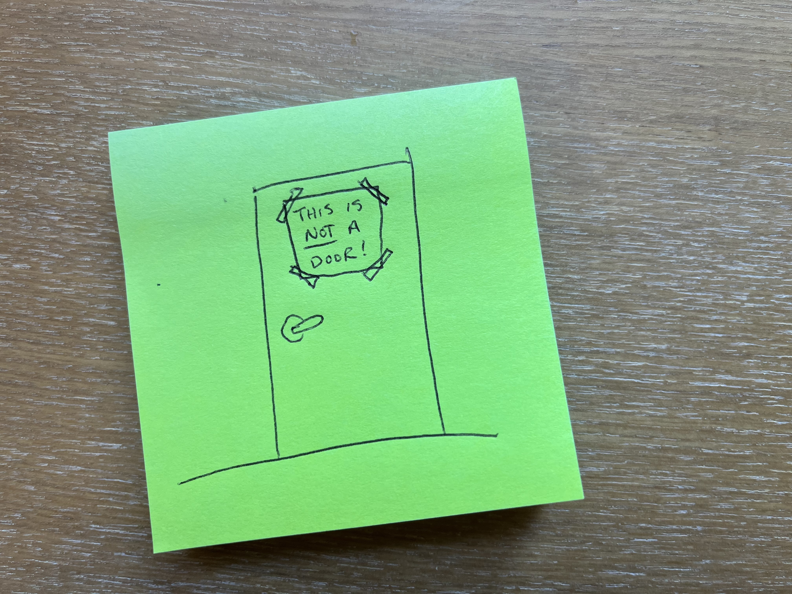
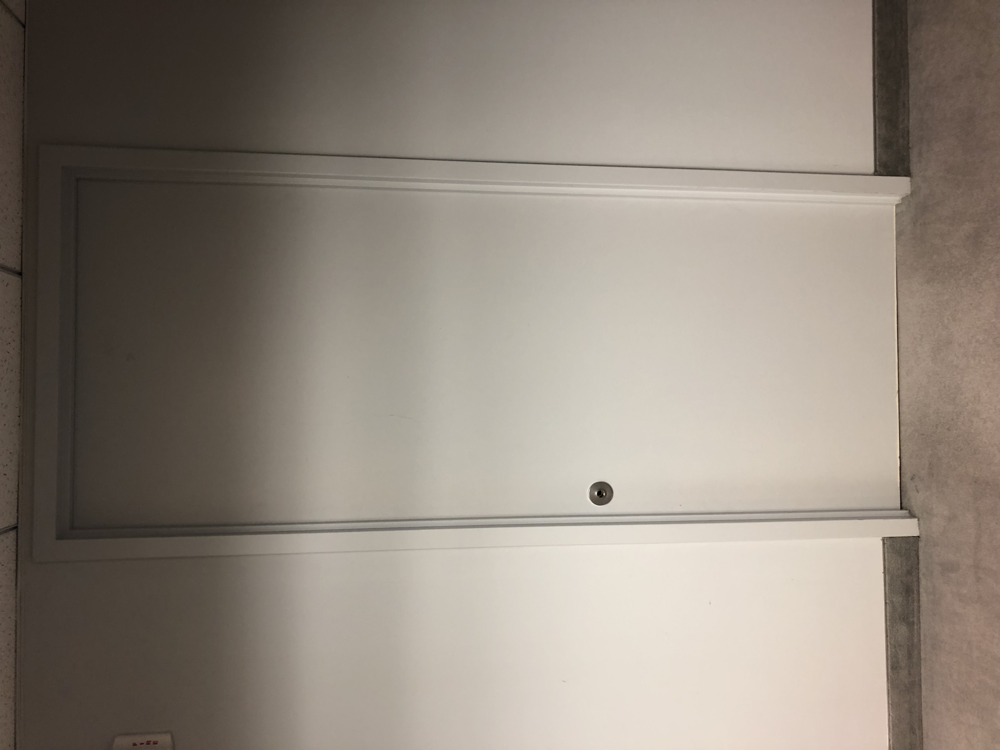

A number of years ago, I worked in a small office at a startup in downtown Washington, DC. One day I came in to work to discover that the developers who worked in one section of the office had rearranged their desks. They had made a new configuration possible by treating one wall with a door in it as a solid wall, lining up several desks against it. But that did leave a problem: what should they do about the door?

Their solution was one that many people have used in the past: they put up a sign on the other side of the door that said "Do not use this door!" 

## Signifiers and Affordances

A sign is a kind of [signifier](https://www.interaction-design.org/literature/topics/signifiers#:~:text=Signifiers%20are%20perceptible%20cues%20that,help%20people%20perform%20appropriate%20tasks.): it gives users a cue as to how to use something. But signifiers--especially signs, or instructional text--can often be a sign that there is something wrong. It can mean that there is tension within an object between multiple signifiers, or between signifiers and [affordances](https://www.interaction-design.org/literature/topics/affordances).

And in this case, that sign was really working against everything else about that door. There was a frame around it. It was inset from the wall. And it had a handle! Affordance is all about the relationship between a user and an object. In this case, that door had a handle, and that handle _afforded_ turning to any human being with an arm and a hand approaching it. It was the most obvious thing about the door, and the sign that my coworkers put up had a tough job arguing that it didn't matter _how_ much that thing looked like a door, it _wasn't_.

I dealt with this problem all the time when working with interfaces. A problem was identified with how users were interacting with something or were _trying_ to interact with something, and the first, easiest suggestion was often to add instructional text. Just tell the user what to do next! This is almost never the best solution.

Users don't want to spend their time reading. How often do you patiently read the instructions first thing when you buy something new? How often do you, instead, do your best to figure out how to assemble or use something on your own, based on its essential properties and your existing knowledge, only breaking out the instructions if that first approach fails?

It can reveal also a tension or lack of harmony in your interface: maybe your own interface is sending contradictory instructions. The user has to handle that tension by picking a winner, but it can lead to a significant diminution of ease and even pleasure in using your interface. "I managed to get that to work, despite their best efforts!" That's not the thought you want your users to have about you.

## Just take off the handle

	
	
It really isn't a door!

When I got in, I asked, "Is there a screwdriver handy?" And I removed the door's handle. It's a _little_ funny to have a door without a handle in the wall, but it also removes the fundamental tension in the interface. That door no longer affords opening, so no one will try to open it. And the sign could be removed.

Any time you're tempted to reach for instructional text in an interface, ask instead: could we remove or fix the attributes of our interface that miscommunicate how it's intended to be used?
