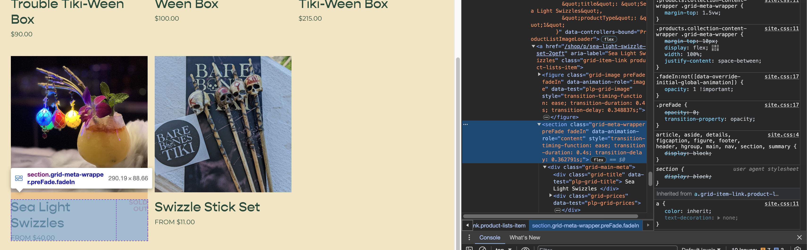

I was doing some present shopping yesterday, and I was reminded of one of the best products I bought _myself_ last year: a set of [Sea Light Swizzles](https://www.barebonestiki.com/shop/p/sea-light-swizzle-set-2geft) from [Bare Bones Tiki](https://www.barebonestiki.com/). Sadly--and understandably--they were sold out. So what does any tiki-loving web developer in my shoes do? Set up a script to check the site every day and email me when they come back in stock.

There are myriad ways of doing this, of course, and I've used [AWS Lambda](https://aws.amazon.com/lambda/) most recently for this kind of thing. But I'd recently heard about a site called [Val Town](https://www.val.town/) that wants to provide a social, minimal friction environment for people to run functions that interact with the rest of the web. The creator, Steve Krouse, was [recently on the Syntax Podcast](https://syntax.fm/show/640/supper-club-val-town-with-steve-krouse), and he talked about his background in teaching coding and how the desire to decrease the size of the hurdle for new programmers in transitioning from more batteries-included development environments like [Scratch](https://scratch.mit.edu/).

Making things easier for novices is well and good, but even those of us who've spent (mumble mumble) years coding for a living have a whole list of things we'd like to do that we _really_ don't want to spend that much time setting up or maintaining. Quick and easy never goes out of style, especially when you've got the work you actually get paid to do waiting for you.

So, when the need to set up a site-checking script came up, I thought I'd give Val Town a shot.

## Preview

I'll write a little bit about my experience figuring things out, but I want to give the final result first for anyone who just wants the final code.

[@hurricanenate/webscrapeBareBonesTiki](https://www.val.town/v/hurricanenate/webscrapeBareBonesTiki)

<iframe src="https://www.val.town/embed/hurricanenate/webscrapeBareBonesTiki" class="val-town embed" style="height: 908px"></iframe>

(Note that Val Town vals use Deno, which means some of the APIs will be different than what you might be used to if you only use NodeJS. It also affects how you import packages.) I'm a big fan of Deno and use it to power this very site, but it's important to note.)

This function fetches the HTML of the Bare Bones Tiki swizzles page, parses it, uses some fancy DOM traversal to check for the status of the item I'm interested in, and then emails me with whether it's currently sold out.

Val Town lets me set the val as an [Interval](https://docs.val.town/scheduled-vals), which has a cron set on it that will run it once a day.

## Other People's Vals

One of Val Town's goals is to make it not only as easy to share bits of code as it is to post to social media sites, but to make it easy to _use_ those bits of code. In my val, I'm using `fetchText` to grab the content of the URL for the product I'm checking, which is just another [val by Steve Krouse](https://www.val.town/v/stevekrouse/fetchText).

```typescript
import { fetchText } from "https://esm.town/v/stevekrouse/fetchText?v=5";
```

Their interface makes it easy to get other people's vals: just type `@` and start typing a name, and you'll see a typeahead open up showing all the public vals that might match your search. (Vals can also be set to unlisted or private.) If you select one, the editor will add the correct import to the top of your val automatically. It's like having an extremely granular [npm](https://npmjs.com) within easy reach.

## Using the DOM



Parsing the DOM of the product page is the only particularly involved logic in my val. The only way to select the correct element was by its text, so I had to select every product title, find the one with the text I wanted, go back up to its container, then back down to grab the status element that said "SOLD OUT." (Val Town's [web scraping reference](https://docs.val.town/web-scraping) has some useful help for learning to do this type of thing.)

It took me a little bit of trial and error to figure out the best way to interact with the DOM in my script. [Val Town's example](https://docs.val.town/web-scraping) recommended using [cheerio](https://www.npmjs.com/package/cheerio), but I didn't want to use a specialized API for DOM traversal. Now that jQuery has remade the modern DOM API in its own image, I'd much rather use standard DOM methods.

Unfortunately, when I tried to use [jsdom](https://www.npmjs.com/package/jsdom), a popular and venerable library, I ran into [`Not implemented: isContext`](https://github.com/denoland/deno/issues/17593) errors: it seems like jsdom is tough to run in Deno. I found a recommendation for [linkedom](https://webreflection.medium.com/linkedom-a-jsdom-alternative-53dd8f699311) as an alternative, and it works great.

```typescript
// Val Town uses Deno, so it's easy to use imports from https://esm.sh
import { DOMParser, Node } from "https://esm.sh/linkedom@0.16.1";

const URL = 'any url';

export const genericWebScraper = async () => {
  const html = await fetchText(URL);
  const document = new DOMParser().parseFromString(html, "text/html");

  // Now you can use document.querySelector() or any other document method just
  // as you would from your console.
}
```

It was a little annoying to figure out how to make TypeScript happy--I may have said a few things off the record about hating TypeScript "so, so much." I've been working with TypeScript for the last few months to stay professionally relevant, and because it _totally_ does have some real benefits when working with shared code bases, and when apps grow in complexity. But I wish there were the option to turn it off in Val Town, where the simpler and more exploratory context makes me prefer vanilla JavaScript.

You can import the Node type from linkedom, too, and then use it to create a [type guard](https://www.typescriptlang.org/docs/handbook/advanced-types.html#type-guards-and-differentiating-types) to assure TypeScript that whatever we get back from `querySelectorAll` is actually an HTML Element.

```typescript
function isHTMLElement(node: Node): node is HTMLElement {
  return node.nodeType === Node.ELEMENT_NODE;
}
```

## How to Email Yourself

It's simple, but one of the most appealing hooks of Val Town is just how easy it makes it to email yourself. (On the [pro plan](https://www.val.town/pricing) you can apparently use it to email any address.) It has a [library of standard vals](https://www.val.town/u/std) with a ton of useful tools, including [email](https://www.val.town/v/std/email).

```typescript
import { email } from "https://esm.town/v/std/email?v=9";

export const myFunc = async () => {
  await email({
    subject: "GREETINGS",
    text: "Hello, creator!",
  })
}
```

## Val Town on Discord

I was running into some significant challenges getting my val working, initially, partially because it turned out Val Town was doing a deploy that partially impacted availability while I was working, and then I got hit by an actual UI change that I didn't understand. So I found my way to [Val Town's Discord](https://discord.gg/dHv45uN5RY) and posted a question... to which the creator Steve Krouse himself responded, inviting me to pair with him on Zoom for a few minutes.

He was able to quickly explain how to get arround the issue that had been tripping me up (involving the distinction between just saving a val and running it), while mining my valuable newcomer's ignorance about how things worked to gather some user testing data.

Suffice it to say that hopping on Discord looks like a great way right now to get help on any questions or issues you might run into.

## Final Thoughts

Val Town is in its early days, and their [last release](https://blog.val.town/blog/introducing-val-town-v3) rolled out some major changes, including breaking ones. But it's an exciting platform, and it will absolutely be what I reach for next time I want to create a little, specific tool or utility to get something done. It feels as easy as something like Zapier or IFTT, but without the barrier between you and _the code_ that their models involve. Consider me hooked!
